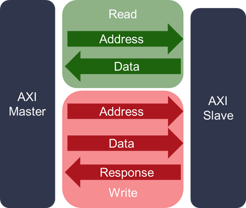
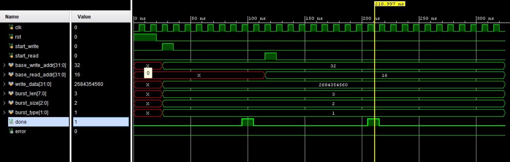

# Design and Verification of AXI4 FULL Communication (One Master – One Slave)

## Project Description  
This project implements AXI4 FULL communication between one master and one slave using Verilog. The design supports burst-based read and write operations with proper handshake between the master and slave. The functionality is verified using simulation.

## Objective  
The main objective of this project is to understand the working of the AXI4 FULL protocol and implement a basic communication system for data transfer in System-on-Chip designs.

## Features  
- Burst read and write support  
- Parameterized burst length, size, and type  
- Handshake-based data transfer  
- Separate address, data, and response channels  
- Functional verification through simulation

## AXI Channels Used  
The following AXI channels are implemented:  
- Write Address Channel  
- Write Data Channel  
- Write Response Channel  
- Read Address Channel  
- Read Data Channel  

Each channel follows VALID and READY handshaking.

## Project Files  
- axi_master.v  
- axi_slave.v  
- axi_top.v  
- tb_axi_top.v  

## Tools Used  
- Verilog HDL  
- Simulation tool such as Vivado  

## Simulation  
The simulation verifies correct burst transfer, address generation, and handshake between master and slave.

## Conclusion  
This project demonstrates AXI4 FULL communication between one master and one slave. The design shows correct read and write operations and can be extended for more complex SoC interconnect systems.
